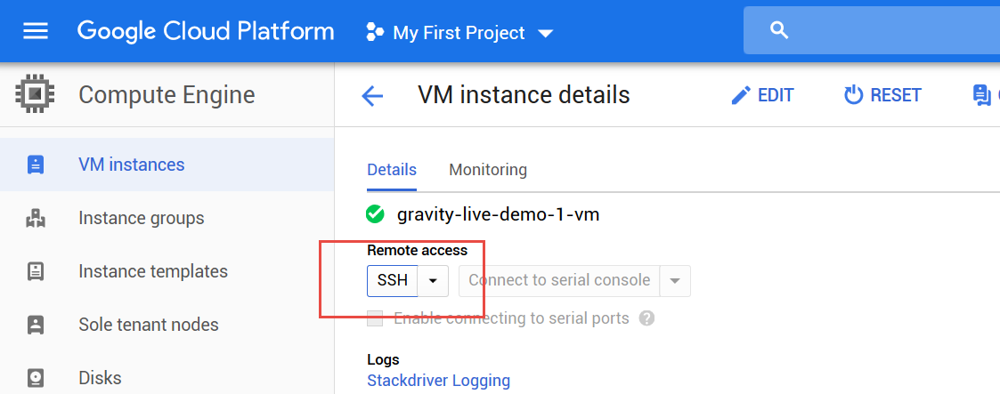
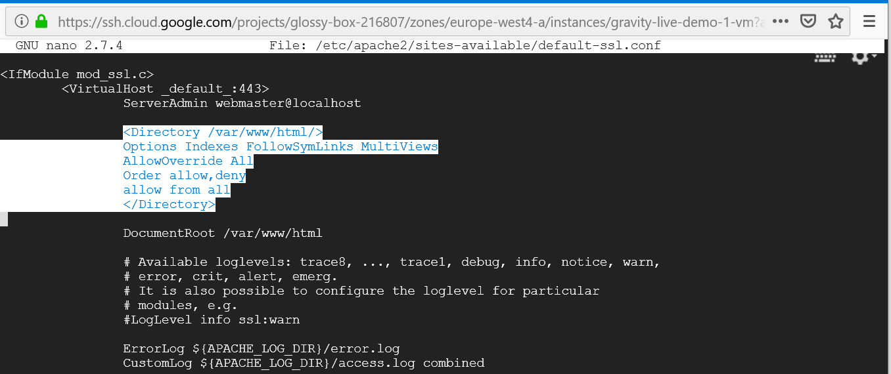
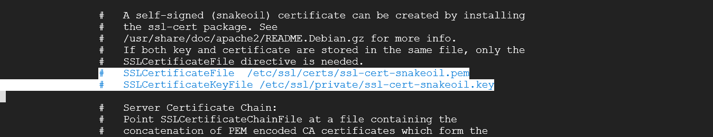
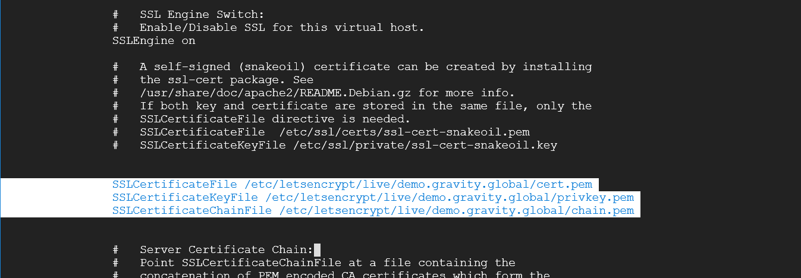
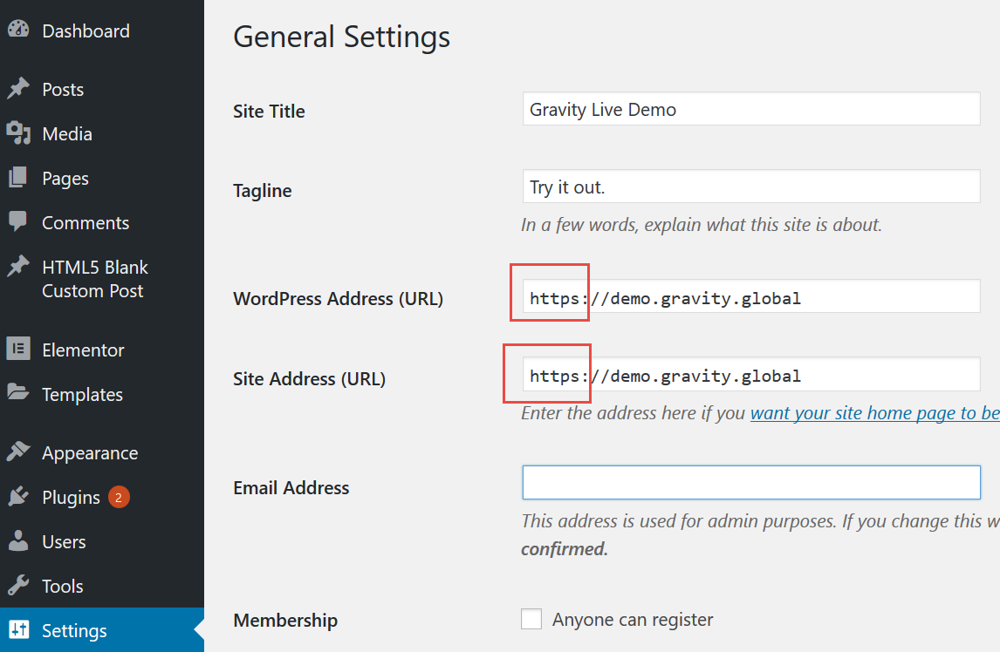

# Setup SSL Certificate for Click to Deploy WordPress on GCP
Source which has some typos and errors on it [Medium article](https://medium.com/@upcscfatehabad/how-to-setup-ssl-certificate-for-click-to-deploy-wordpress-on-gcp-fe7e55bd2c27)

***

## 1. Connect to Google Cloud Platform



## 2. Install Certbot Client
`sudo wget https://dl.eff.org/certbot-auto && chmod a+x certbot-auto`

## 3. Generate Certificates
`./certbot-auto certonly --webroot -w /var/www/html -d demo.gravity.global`

`/etc/letsencrypt/archive` and `/etc/letsencrypt/keys` contains all previous keys and certificates, while `/etc/letsencrypt/live` symlinks to the latest versions.

`sudo ls -la /etc/letsencrypt/live/demo.gravity.global`

```
drwxr-xr-x 2 root root 4096 Apr 11 09:06 .
drwx------ 3 root root 4096 Apr 11 09:18 ..
lrwxrwxrwx 1 root root   43 Apr 11 09:06 cert.pem -> ../../archive/demo.gravity.global/cert1.pem
lrwxrwxrwx 1 root root   44 Apr 11 09:06 chain.pem -> ../../archive/demo.gravity.global/chain1.pem
lrwxrwxrwx 1 root root   48 Apr 11 09:06 fullchain.pem -> ../../archive/demo.gravity.global/fullchain1.pem
lrwxrwxrwx 1 root root   46 Apr 11 09:06 privkey.pem -> ../../archive/demo.gravity.global/privkey1.pem
-rw-r--r-- 1 root root  692 Apr 11 09:06 README
```

## 4. Test Certificate Renewal
`sudo ./certbot-auto renew`

Expected result:
```
Saving debug log to /var/log/letsencrypt/letsencrypt.log
- - - - - - - - - - - - - - - - - - - - - - - - - - - - - - - - - - - - - - - -
Processing /etc/letsencrypt/renewal/demo.gravity.global.conf
- - - - - - - - - - - - - - - - - - - - - - - - - - - - - - - - - - - - - - - -
Cert not yet due for renewal
- - - - - - - - - - - - - - - - - - - - - - - - - - - - - - - - - - - - - - - -
The following certs are not due for renewal yet:
  /etc/letsencrypt/live/demo.gravity.global/fullchain.pem expires on 2019-07-10 (skipped)
No renewals were attempted.
- - - - - - - - - - - - - - - - - - - - - - - - - - - - - - - - - - - - - - - -
```

## 5. Move Certbot-Auto Package
`sudo mv certbot-auto /etc/letsencrypt/`  -> to move the To move the Certbot-Auto package

`ls /etc/letsencrypt/`  -> to check Certbot-Auto package is present in correct folder

## 6. Configure Crontab file for Auto-Renewal
To configure the your SSL certificate for auto-renewal we need to configure the crontab that will automatically renew the SSL certificate before they expire.

`sudo crontab -e` -> use nano

and add 

`45 2 * * 6 cd /etc/letsencrypt/ && ./certbot-auto renew && /etc/init.d/apache2 restart`

to the file. Save (^O) and exit (^X).

***

## 7. Configure the Certificates
Edit the default-SSL.conf file:

`sudo nano /etc/apache2/sites-available/default-ssl.conf`

At the top of default-ssl.conf file , paste the following lines of code in order to tell your server to direct network traffic to https port 443.

```
<Directory /var/www/html/>
Options Indexes FollowSymLinks MultiViews
AllowOverride All
Order allow,deny
allow from all
</Directory>
```


Use # sign to commenting the snakeoil certificates 



and paste below path to your three SSL certificate as shown in below command :
```
SSLCertificateFile /etc/letsencrypt/live/demo.gravity.global/cert.pem
SSLCertificateKeyFile /etc/letsencrypt/live/demo.gravity.global/privkey.pem
SSLCertificateChainFile /etc/letsencrypt/live/demo.gravity.global/chain.pem
```



Save (^O) and exit (^X).


## 9. Restart the Apache Server
In order for certificate changes to take effect you need to update/restart our Apache server by executing all three commands.

```
sudo a2ensite default-ssl
sudo a2enmod ssl
sudo service apache2 restart
```

In case of an error check the log under with `journalctl -xe`

## 10. Update WordPress URLs
In the last step we logged in wordpress >> Settings >> General and replaced our current domain setting with https:// version.

